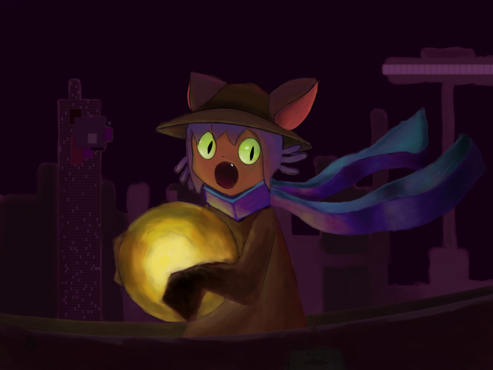

# 👻 Saudações

Meu nome é Kali, sou uma estudante de **Ciência da Computação** na **UFLA**, e meus pronomes são *ela/dela*.

## Experiências

Criei o site [Mapa de Ações Afirmativas](https://mapadeacoesafirmativas.com/) junta do grupo de pesquisa do Colégio Latino Americano de Estudos Mundiais

Embora **cybersegurança** seja o assunto que mais me fascina, tenho experiência em algumas áreas diferentes. Respectivamente, de onde sou mais experiente, também já trabalhei com:

* Desenvolvimento Full-Stack
* Back-end
* Programação matemática
* Microcontroladores e sistemas embarcados
* Desenvolvimento de jogos

## Competências

Já desenvolvi usando:

* C++
* Python
* PHP
* JavaScript
* Java
* Blender
* Unity
* Git
* MySQL
* HTML/CSS
* JQuery
* Bootstrap
* GNU Linux
* Scripts Bash
* Google Maps API

## Interesses

Quando não estou trabalhando com meu amigo [Marcos](https://github.com/Marcos-Pimentel/minhabio-gcc259) e o Prof. Mayron Moreira em *algoritmos de otimização de talhonamento*, gosto de estudar sobre o [funcionamento de videogames antigos](https://www.youtube.com/c/RetroGameMechanicsExplained), [exploits de segurança](https://www.youtube.com/channel/UClcE-kVhqyiHCcjYwcpfj9w), [produção de música](https://www.youtube.com/c/andrewhuang) e [cinematografia](https://www.youtube.com/c/corridorcrew). Também gosto de jogar tanto jogos eletrônicos quanto jogos tabletop como *Magic: the Gathering* e *Dungeon and Dragons*.

> "When life gives you lemons, don't make lemonade. Make life take the lemons back! Get mad! I don't want your damn lemons, what the hell am I supposed to do with these? Demand to see life's manager! Make life rue the day it thought it could give Cave Johnson lemons! Do you know who I am? I'm the man who's gonna burn your house down! With the lemons! I'm gonna get my engineers to invent a combustible lemon that burns your house down!" - Cave Johnson

## Projetos incríveis open-source

[Blender, faz-tudo 3D e mais um pouco em animações 2D e edição de vídeo](https://github.com/blender/blender)

[Furnace, tracker e emulador de chiptune](https://github.com/tildearrow/furnace)

[Obsidian, editor e organizador de textos em *MarkDown*](https://github.com/obsidianmd/obsidian-releases)

## Minha arte

